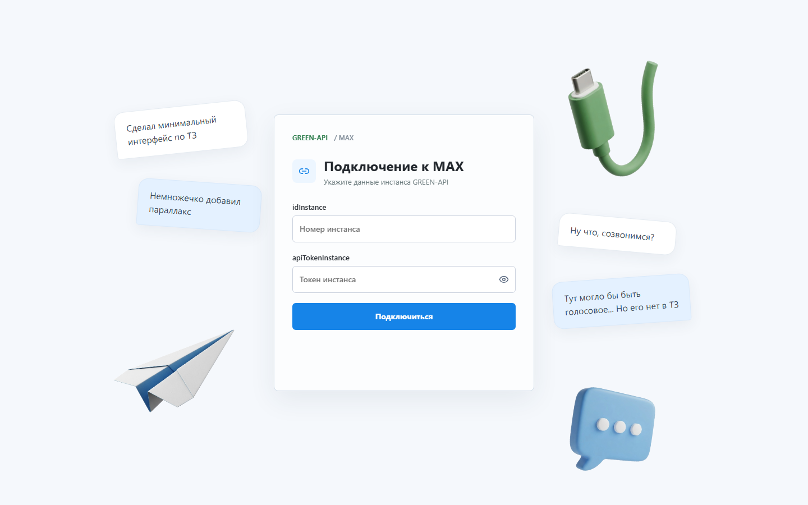
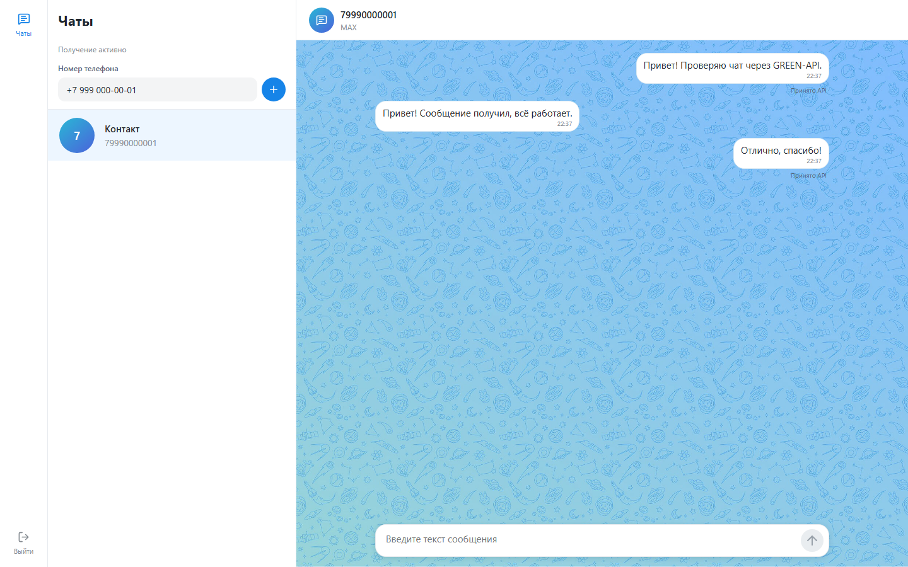

# Тестовый чат MAX

Небольшое React-приложение для текстового обмена через GREEN-API MAX. Пользователь вводит данные своего авторизованного инстанса, создаёт чат по телефону, отправляет текст и видит входящий ответ. Приложение обращается к `https://3100.api.green-api.com` непосредственно из браузера; собственного сервера и базы данных нет.

## Запуск

Требуется Node.js 22.12+ и npm. Локальные проверки выполнены с Node.js 26.7.0 и npm 11.19.0. Из корня репозитория:

```sh
npm ci
npm run dev
```

Откройте адрес, напечатанный Vite. Для проверки production-сборки:

```sh
npm run build
npm run preview
```

Проверки (из корня репозитория):

```sh
npm run typecheck
npm run lint
npm test -- --run
npm run test:e2e
```

E2E использует Playwright Chromium и только вымышленные данные с route-моками. При первом запуске установите браузер командой `npx playwright install chromium`. Тест сам поднимает Vite на `127.0.0.1:5197`; порт должен быть свободен. Видео и трассировка отключены; снимки адаптивного интерфейса сохраняются в `test-results/`.

## Возможности и стек

- Подключение по `idInstance` и `apiTokenInstance`, проверка авторизации инстанса.
- Создание и выбор чатов по номеру телефона через CheckAccount.
- Отправка текста через SendMessage; входящие через ReceiveNotification с подтверждением DeleteNotification.
- Независимые черновики, состояние отправки, ручной повтор при ошибке и управление получением уведомлений.
- Адаптивный чат по мотивам web.max.ru. Экран подключения с предметными изображениями, GSAP-параллаксом и полётом самолётика после успешной авторизации; поддержка `prefers-reduced-motion`.

Стек: React 19, TypeScript, Vite, CSS Modules, GSAP, Lucide. Тесты: Vitest, React Testing Library и Playwright. Зависимости зафиксированы в `package-lock.json`.

## Скриншоты

Снимки показывают текущий интерфейс с вымышленными данными и подменёнными ответами API; это демонстрация дизайна, а не подтверждение реальной доставки.





Мобильная версия: [подключение](docs/screenshots/connection-mobile.png), [чат](docs/screenshots/chat-mobile.png).

Для обновления снимков запустите `npm run dev -- --host 127.0.0.1 --port 5201`, затем в другом терминале `npm run screenshots`. Скрипт использует только демонстрационные данные. Другой адрес можно задать через переменную `SCREENSHOT_URL`.

## Настройка GREEN-API

Нужен авторизованный инстанс **MAX Developer**. В кабинете включите входящие уведомления (`incomingWebhook`), а `webhookUrl` оставьте пустым для HTTP API. В форме приложения введите `idInstance` и `apiTokenInstance`; не помещайте их в `.env`, исходники или адресную строку. Укажите номер получателя в поддерживаемом формате РФ (`7` + 10 цифр) или РБ (`375` + 9 цифр). Приложение проверит его через CheckAccount и использует возвращённый `chatId`.

Запросы на получение используют очередь ReceiveNotification и подтверждаются DeleteNotification. Журнал входящих в кабинете или LastIncomingMessages не является этой очередью. Для одного инстанса держите **одного потребителя очереди**: параллельный Postman, вторая вкладка или другое приложение могут перехватить уведомление раньше этого чата.

Статус «Принято API» означает успешный ответ SendMessage, но **не доставку** адресату. При неопределённом результате автоматического повтора нет: ручный повтор может создать дубль. Чаты, черновики и токен хранятся только в памяти вкладки и исчезают при выходе или обновлении страницы; история сообщений с сервера не подгружается. Реализованы только текстовые сообщения. Проверка длины 4000 символов основана на JS code units; поведение сервера для сложного Unicode отдельно не подтверждено.

Тариф Developer и состояние инстанса могут ограничивать доступные операции. Не используйте реальные данные в тестах, отчётах и скриншотах. Адрес GREEN-API фиксирован для этого проекта; если для вашего инстанса указан другой API-хост, код и CSP хостинга потребуется согласованно изменить.

## Размещение

Собранный каталог `dist/` можно разместить на статическом HTTPS-хостинге. `public/_headers` содержит рекомендуемые заголовки для Netlify/Cloudflare Pages; на другой платформе настройте эквивалентные HTTP-заголовки вручную. Проверьте фактически выданные CSP (`connect-src https://3100.api.green-api.com`), `frame-ancestors 'none'`, `Referrer-Policy: no-referrer` и HTTPS. После публикации отдельно повторите живой цикл с домена демо. Локальные тесты не подтверждают CORS на домене демо.

Результаты и остающиеся проверки: [приёмка](docs/ACCEPTANCE.md). Материалы для отправки работодателю: [чек-лист и черновик письма](docs/SUBMISSION.md).
